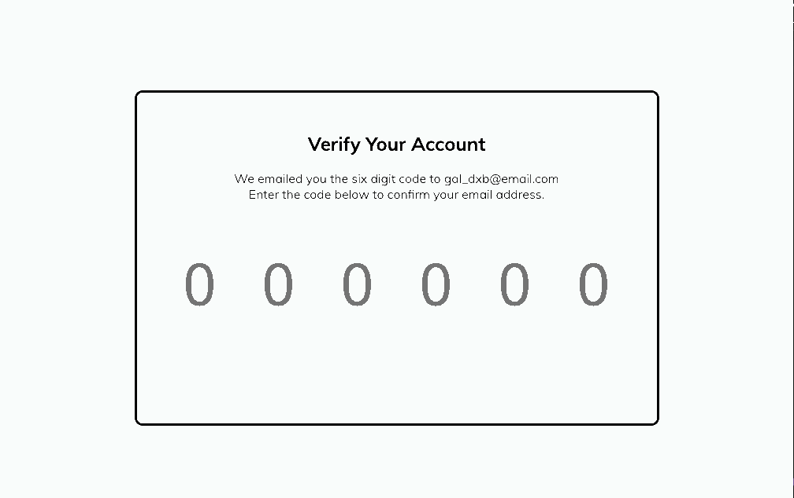

# Verify Account UI.

## About The Project

You might have seen this if you've signed up for something and you were required to verify your account.
This is a mini project to showcase the verification UI. No function to send the code is applied here.
In this example you have 6 inputs for your code. If you make a mistake you can hit a backspace and change that number.
You can use this UI style for your projects that would require verification or simply check the methods applied for your learning benefit.

## Preview

## Built With

1. [CSS ::valid](https://developer.mozilla.org/en-US/docs/Web/CSS/:valid)
2. [HTMLElement.focus()](https://developer.mozilla.org/en-US/docs/Web/API/HTMLElement/focus)
3. [Keyboard events & codes](https://www.freecodecamp.org/news/javascript-keycode-list-keypress-event-key-codes/)

## Installation

This is a working code example.
You can copy the CSS and Javascript code as is and use it in your projects.
Or you can download the code as a ZIP file and unzip it. No web server required, you can see it live through your localhost by opening index.html with your browser. Alternatively, you can open your project with VS Code and click on **Go Live** at the bottom right corner, it should open in your default browser.

## Contributing

1. Fork the Project
2. Create your Feature Branch (`git checkout -b feature/AmazingFeature`)
3. Commit your Changes (`git commit -m 'Add some AmazingFeature'`)
4. Push to the Branch (`git push origin feature/AmazingFeature`)
5. Open a Pull Request

## License

MIT License

Copyright (c) 2021 Shay Asanova

Permission is hereby granted, free of charge, to any person obtaining a copy
of this software and associated documentation files (the "Software"), to deal
in the Software without restriction, including without limitation the rights
to use, copy, modify, merge, publish, distribute, sublicense, and/or sell
copies of the Software, and to permit persons to whom the Software is
furnished to do so, subject to the following conditions:

The above copyright notice and this permission notice shall be included in all
copies or substantial portions of the Software.

THE SOFTWARE IS PROVIDED "AS IS", WITHOUT WARRANTY OF ANY KIND, EXPRESS OR
IMPLIED, INCLUDING BUT NOT LIMITED TO THE WARRANTIES OF MERCHANTABILITY,
FITNESS FOR A PARTICULAR PURPOSE AND NONINFRINGEMENT. IN NO EVENT SHALL THE
AUTHORS OR COPYRIGHT HOLDERS BE LIABLE FOR ANY CLAIM, DAMAGES OR OTHER
LIABILITY, WHETHER IN AN ACTION OF CONTRACT, TORT OR OTHERWISE, ARISING FROM,
OUT OF OR IN CONNECTION WITH THE SOFTWARE OR THE USE OR OTHER DEALINGS IN THE
SOFTWARE.

## Contact

shay[dot]asanova[at]gmail[dot]com
